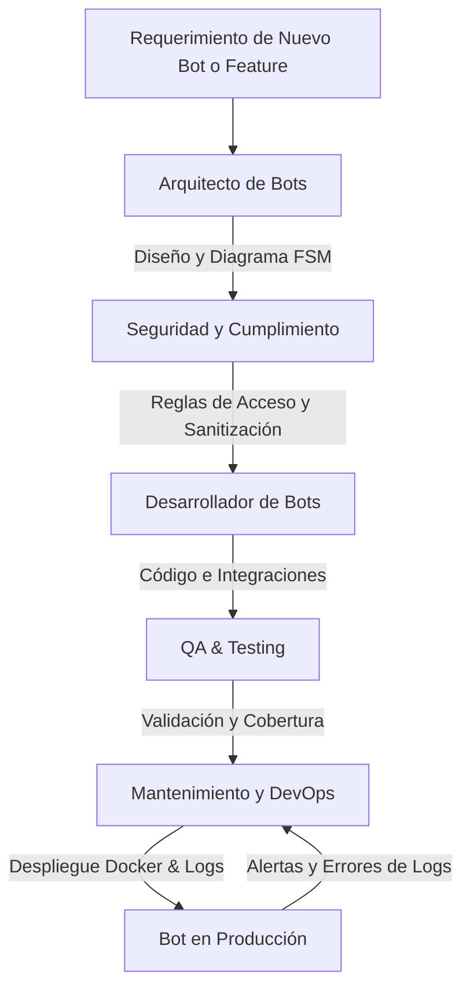

# 🤖 Equipo de Agentes Especializados en Bots

Este directorio contiene las definiciones de los agentes de IA especializados en la creación, evolución, optimización, pruebas, seguridad y mantenimiento operativo de bots (enfocados principalmente en Telegram, Node.js/Grammy, Docker, e integraciones con Google Sheets / APIs externas).

---

## 👥 Miembros del Equipo de Agentes

| Agente | Archivo | Rol Principal |
| :--- | :--- | :--- |
| **Arquitecto de Bots** | [`bot-architect-agent.md`](./bot-architect-agent.md) | Diseño de arquitectura, máquinas de estados (FSM), estrategia Webhook/Polling y modelado de datos. |
| **Desarrollador de Bots** | [`bot-developer-agent.md`](./bot-developer-agent.md) | Implementación de handlers, middlewares, teclados (Inline/Reply), comandos y lógica de negocio. |
| **QA & Testing de Bots** | [`bot-qa-testing-agent.md`](./bot-qa-testing-agent.md) | Pruebas unitarias de handlers, simulación/mocking de context de Telegram y validación de flujos. |
| **Mantenimiento y DevOps** | [`bot-ops-maintenance-agent.md`](./bot-ops-maintenance-agent.md) | Despliegue en Docker, monitoreo de logs (Pino), resiliencia ante rate limits (429 Flood Wait) y recuperación. |
| **Seguridad y Cumplimiento** | [`bot-security-compliance-agent.md`](./bot-security-compliance-agent.md) | Autenticación (Chat ID whitelisting), control de acceso RBAC, sanitización y protección de secretos. |

---

## 🔄 Flujo de Trabajo Recomendado

1. **Planificación**: Utiliza el **Arquitecto** para estructurar comandos, flujos conversacionales y persistencia.
2. **Seguridad**: Revisa con **Seguridad** el control de acceso a comandos sensibles.
3. **Desarrollo**: Invoca al **Desarrollador** para escribir la lógica modular (handlers, services, utils).
4. **Pruebas**: Pide a **QA & Testing** crear pruebas mockeadas del bot.
5. **Operaciones**: Apoyate en **DevOps & Mantenimiento** para configurar Docker, rotación de logs y manejo de errores 429.

---

## 💡 Ejemplos de Invocación

- *"Actúa como el **Arquitecto de Bots** y diseña un flujo paso a paso para registro de usuarios con confirmación por teclado Inline."*
- *"Actúa como el **Desarrollador de Bots** e implementa el handler `/reporte` conectándolo a Google Sheets."*
- *"Actúa como **Mantenimiento y DevOps** y revisa los logs para prevenir caídas por el límite de peticiones de Telegram."*
