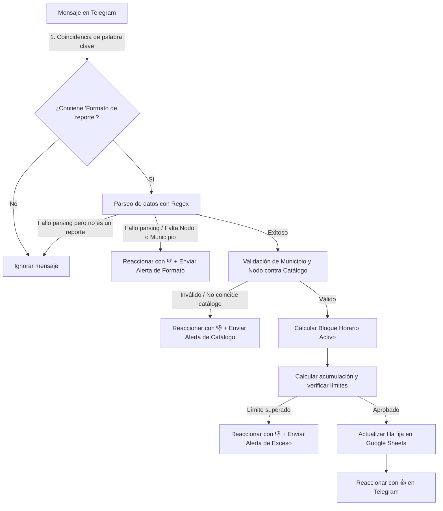

# 🤖 Documentación Oficial de las Reglas de Negocio
## Telegram & Google Sheets Real-Time Synchronizer

Este bot de Telegram empresarial está diseñado para automatizar la **supervisión de personal y el reporte de novedades en campo (verificadores) en tiempo real** para el estado Monagas. Los supervisores envían reportes en grupos de Telegram, y el bot los valida, calcula acumulados por bloques horarios y los sincroniza al instante en una hoja de cálculo unificada de Google Sheets.

Este documento establece la **definición canónica y formal** de todas las reglas de negocio aplicadas por el sistema.

---

## 1. El Ciclo de Vida del Reporte

El flujo de procesamiento de un reporte se divide en las siguientes etapas consecutivas:

---

## 2. Definición y Reglas de los Bloques Horarios (Shifts)

La jornada diaria de supervisión se organiza en **3 bloques de tiempo rígidos** basados en la zona horaria de Venezuela (`America/Caracas`):

| Bloque | Hora de Corte | Rango Horario Activo |
| :--- | :--- | :--- |
| **Bloque 1 (B1)** | 9:00 AM | Antes de las 09:00 AM |
| **Bloque 2 (B2)** | 2:00 PM | 09:00 AM - 02:00 PM (14:00 VET) |
| **Bloque 3 (B3)** | 6:00 PM | 02:00 PM - 06:00 PM (18:00 VET) |

---

## 3. Lógica Estricta de Bloqueo Horario: Pasado vs. Presente/Futuro

El procesamiento de datos se divide estrictamente según la temporalidad del bloque en el momento en que se procesa el mensaje (fecha/hora de creación o edición según corresponda):

### A. Regla del Pasado Bloqueado (`LOCKED`)
*   Cualquier bloque horario cuya hora de corte ya haya transcurrido se considera **pasado** y queda estrictamente en modo de **lectura únicamente**.
*   **El pasado no se toca bajo ninguna circunstancia**: El bot no modificará, sobrescribirá ni borrará los valores históricos de bloques pasados en Google Sheets (incluso si el reporte entrante indica `0` o si se edita el mensaje original con datos diferentes para ese bloque).
*   *Excepción técnica (Incrementos tardíos)*: Si un reporte en el bloque presente indica un valor mayor en un bloque pasado al que ya está registrado, la diferencia positiva se acumulará al bloque **presente** para no perder el dato pero sin alterar la celda del bloque pasado.

### B. Regla del Presente y del Futuro Abiertos (`OPEN`)
*   El bloque activo actual (**presente**) y los bloques que aún no han ocurrido (**futuro**) están abiertos para **escritura y edición**.
*   Se pueden actualizar libremente con los valores reportados en el mensaje entrante, incluyendo el valor **cero (`0`)** (por ejemplo, para indicar inactividad en el turno o corregir un reporte anterior en el presente/futuro).

---

## 4. Clasificación y Tratamiento de Formatos de Reporte

El bot soporta dos variantes en la estructura de los mensajes de reporte:

### A. Reportes con Bloques Específicos
Ocurre cuando el mensaje contiene de forma explícita las líneas correspondientes a los bloques (ej. `➡️Bloque (1) 9am: X`).
*   **Detección:** Si el parseador identifica al menos una línea de bloque de forma explícita.
*   **Tratamiento:** Se extraen los valores individuales de cada bloque (valores ausentes o vacíos se asumen como `0` explícito). 
*   **Acumulación:**
    *   Los bloques **pasados** mantienen su valor del historial de Sheets.
    *   Los bloques **presentes** y **futuros** se actualizan exactamente con los valores numéricos extraídos del mensaje (incluyendo `0`).
    *   Si un bloque pasado reportado trae un valor superior al historial de Sheets, la diferencia positiva se le suma al bloque presente.

### B. Reportes Generales (Fallback de Bloque Activo)
Ocurre cuando el mensaje no especifica las líneas de bloques horarios, sino únicamente la línea de total (ej. `Total de Verificadores en el nodo: X`).
*   **Detección:** Si el parseador no detecta ninguna línea de bloque específica en el texto.
*   **Tratamiento:** El total general reportado se aplica como fallback **exclusivamente al bloque activo (presente)**.
*   **Acumulación:**
    *   Los bloques **pasados** mantienen su valor del historial de Sheets.
    *   El bloque **presente** toma el valor del total general (incluso si es `0`).
    *   Los bloques **futuros** se inicializan a `0`.

---

## 5. Validación de Catálogos y Límites de Capacidad

Para asegurar la veracidad y calidad de los datos, cada reporte entrante se somete a validaciones en tiempo real contra la pestaña oficial **`verificadores_nodo`**:

1.  **Validación de Municipio y Nodo (Catálogo):**
    *   Se comprueba que el nodo reportado exista y corresponda exactamente al municipio indicado en la base de datos oficial.
    *   Si la validación falla (ej. nodo inexistente o municipio mal escrito), el bot rechaza el reporte, reacciona con `👎` y envía al supervisor una alerta descriptiva detallando la falta/error en el municipio o nodo.
2.  **Validación de Capacidad Máxima:**
    *   Tras calcular la acumulación diaria proyectada ($\text{B1} + \text{B2} + \text{B3}$), se compara con la columna `CANTIDAD DE VERIFICADORES` en la base de datos oficial.
    *   Si el total supera el límite autorizado para ese nodo, el reporte es **rechazado por completo** (no se escribe ningún dato en Sheets, se reacciona con `👎` y se le envía una alerta descriptiva al supervisor informando el exceso de capacidad).

---

## 6. Gestión de Ediciones y Período de Holgura (Grace Period)

Para evitar desajustes provocados por correcciones tipográficas o de formato:

*   **Periodo de Holgura de Edición (10 Minutos):**
    *   *Holgura:* Si el supervisor edita su mensaje original en Telegram dentro de los **10 minutos** posteriores a su envío, el bot re-procesará el reporte utilizando la **hora de creación original**.
    *   *Posterior:* Si se edita pasados los 10 minutos, se procesará utilizando la **hora de la edición**, por lo que los bloques podrían desplazarse y aplicar las reglas de bloqueo sobre el nuevo bloque activo.
*   **Marcado para Revisión Temporal:**
    *   Si una edición altera el reporte de forma que pase a ser inválido (ej. excede el límite del nodo), la fila en Google Sheets no se borra de inmediato.
    *   Se marca en la columna `Estado` como `Revisión desde: [Timestamp]`. Si el supervisor no corrige el reporte a un estado válido en **5 minutos**, el proceso de limpieza lo purgará permanentemente restableciendo los valores a cero.

---

## 7. Automatización en Segundo Plano (Cleanup Jobs)

El bot cuenta con un programador (*Background Worker*) que ejecuta tareas periódicas automáticas:

1.  **Limpieza por Mensajes Eliminados (Cada 5 minutos):**
    *   El bot examina las últimas 60 filas modificadas en Google Sheets.
    *   Verifica mediante la API de Telegram si los mensajes originales asociados a esas filas siguen existiendo en el chat.
    *   Si un mensaje fue eliminado del chat de Telegram, el bot **resetea la fila correspondiente a cero** en Google Sheets de manera inmediata.
2.  **Limpieza Manual de Mensajes:**
    *   Si un supervisor edita un mensaje y escribe alguna palabra clave de eliminación (`"eliminar"`, `"borrar"`, `"eliminado"`, `"borrado"`), el bot borra el mensaje del chat y resetea a cero su fila fija en Google Sheets.

---

## 8. Resguardo Diario y Limpieza de Medianoche (Reset)

*   **Resguardo Histórico (11:00 PM VET):**
    *   El bot realiza un volcado exacto del consolidado del día y lo almacena con marca temporal en la pestaña `registros_historicos_telegram`.
*   **Limpieza de Medianoche (12:00 AM VET):**
    *   Para dar inicio a la siguiente jornada laboral, el bot restablece todas las filas fijas de la pestaña de reportes (`B1`, `B2`, `B3`, `Total`) de vuelta a `0` y actualiza la columna de fecha.
