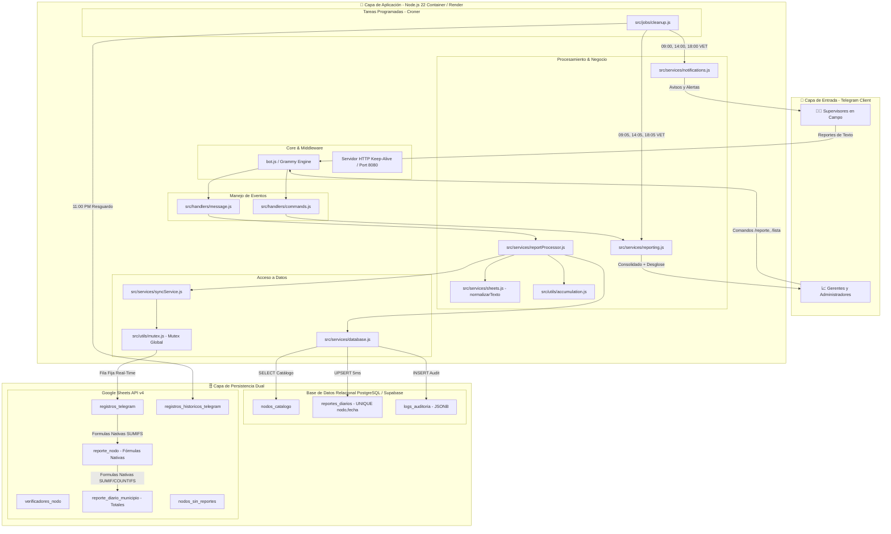
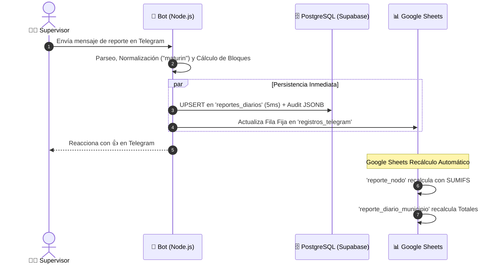

# 🏗️ Arquitectura General del Sistema

Este documento describe la arquitectura técnica, componentes, flujo de datos y estrategia de persistencia del **Bot de Telegram para Supervisión de Campo y Sincronización Dual (Supabase + Google Sheets)**.

---

## 📐 Diagrama de Arquitectura de Alto Nivel

---

## 🧩 Componentes Principales y Responsabilidades

### 1. Engine y Servidor (`bot.js`)
- Inicializa el cliente Grammy con el token de Telegram.
- Expone un servidor HTTP de keep-alive en el puerto `8080`/`10000` para mantener el servicio activo en Render sin cierres por inactividad.

### 2. Capa de Negocio (`src/services/`)
- **`reportProcessor.js`**: Orquesta el procesamiento de reportes. Extrae municipio/nodo, aplica normalización de texto (`normalizarTexto`), consulta los valores anteriores del día, acumula los bloques y ejecuta el guardado dual.
- **`database.js`**: Cliente agnóstico de PostgreSQL (Supabase) con opciones optimizadas para Node.js (`realtime: { disabled: true }`). Realiza validación de nodos, `UPSERT` en `reportes_diarios` e inserta auditoría con `JSONB`.
- **`syncService.js`**: Canal de resguardo asíncrono que actualiza la fila fija en Google Sheets de forma coordinada a través del `Mutex` global.
- **`reporting.js`**: Genera los informes consolidados, calcula porcentajes de avance del estado Monagas y construye el desglose de nodos faltantes.

### 3. Tareas Programadas (`src/jobs/cleanup.js`)
- **Avisos de Cierre (09:00 AM, 02:00 PM, 06:00 PM VET)**: Informa el cambio de bloque activo en el grupo.
- **Reporte a Gerencia (09:05 AM, 02:05 PM, 06:05 PM VET)**: Envía los resúmenes consolidados de porcentajes y el desglose final de faltantes.
- **Alerta de Inactivos (06:06 PM VET)**: Identifica y guarda en `nodos_sin_reportes` los nodos con 0 reportes en el día.
- **Resguardo Nocturno (11:00 PM VET)**: Copia inmutable a `registros_historicos_telegram`.
- **Reset Diario (12:00 AM VET)**: Limpia y reordena la hoja principal para la nueva jornada.

---

## 🗄️ Arquitectura de Persistencia Dual

